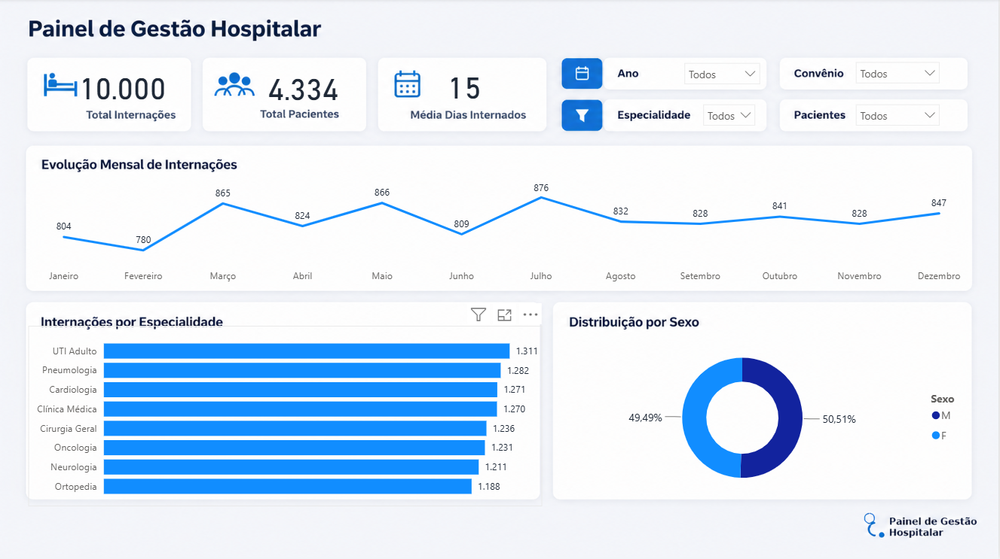

# 🏥 Painel de Gestão Hospitalar

Dashboard interativo desenvolvido para acompanhamento e análise de métricas operacionais hospitalares, permitindo a visualização de internações, especialidades ativas e tempo médio de permanência.

---

## 📸 Demonstração do Painel

## 📊 Principais Métricas e Funcionalidades

* **KPIs Operacionais:** Total de Internações, Pacientes Únicos e Média de Dias Internados.
* **Evolução Temporal:** Gráfico de linha mostrando a variação mensal do volume de internações.
* **Análise por Especialidade:** Distribuição e volume de atendimento por área médica.
* **Perfil Demográfico:** Proporção de internações por sexo.
* **Filtros Dinâmicos:** Segmentação por Ano, Especialidade, Convênio e Paciente.

---

## 🛠️ Tecnologias Utilizadas

* **Power BI:** Construção dos visuais, modelagem de dados e layout.
* **SQL:** Criação do banco de dados relacional e consultas de extração.

---

## 📁 Estrutura do Repositório

* `/DataSet`: Bases e arquivos de dados utilizados.
* `/Documentacao`: Documentação e regras de negócio do projeto.
* `/PowerBi`: Arquivo interativo `.pbix` do painel.
* `/SQL`: Scripts de criação e população do banco de dados.

[def]: ./Documentacao/dashboard.png

## 📊 Análise de Dados e Indicadores Chave

Para apoiar a tomada de decisão da gestão hospitalar, foram criadas consultas analíticas em SQL (`SQL/04_Analise_Negocio_Hospitalar.sql`) focadas em otimização operacional, eficiência leito/dia e planejamento financeiro:

* **Tempo Médio de Permanência por Especialidade:** Mapeamento da média de dias de internação por especialidade médica, identificando gargalos na rotação de leitos e direcionando ações de desospitalização segura.
* **Sazonalidade e Volume de Atendimentos:** Análise do histórico mensal de internações (via `Dim_Calendario`) para antecipar picos de demanda, permitindo dimensionar escalas de enfermagem e insumos com antecedência.
* **Participação por Convênio:** Levantamento do volume e representatividade percentual de cada operadora de saúde sobre o total de internações, gerando insumos para negociações contratuais e reajustes.